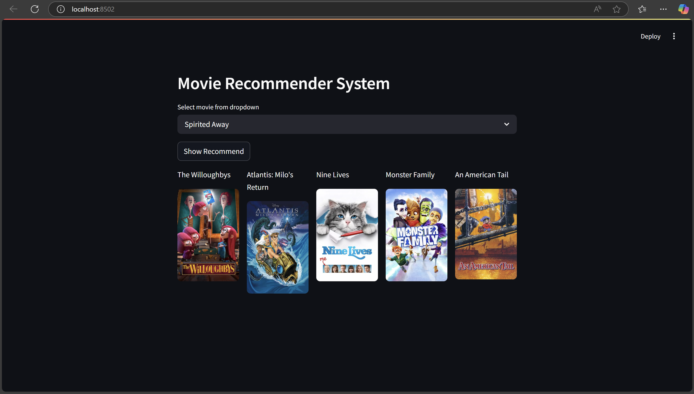

# movie recommender system

## How to Use
- clone project
- install the rquired lib - Numpy , Pandas , pickle, streamlit, sklearn
- run the Main.ipynb file to generate the model
- run the app.py using `streamlit run app.py`

## Outputs

